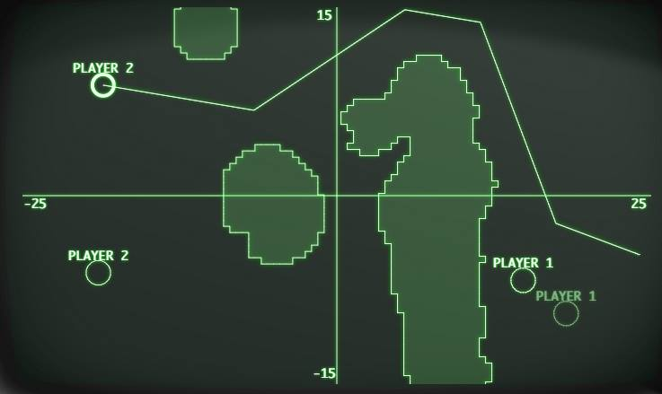

GraphingSolver
==============

Solver script for [Axis the Game](http://www.axisthegame.com/) and [GraphWar](http://www.graphwar.com/play.html)!

Axis and GraphWar are turn-based games where you fire artillery at other players using mathematical functions.

This is a script that generates functions of your choice that go through any points you choose. Simply select the points, and it will generate a function that appears as line segments connecting them.

Requirements
------------

This script requires [PyUserInput](https://github.com/SavinaRoja/PyUserInput), which is a library for working with keyboard and mouse event sending and receiving.

This in turn requires PyHook and PyWin32 on Windows, and XLib on Linux.

Automatic copying of the formula to the clipboard is only supported on Windows.

Usage
-----

Start the script. A prompt will show up with some instructions. Dismiss the prompt and left click on the top left corner of the graph axes, and then left click on the bottom right of the graph axes. The more precise this is, the better the resulting formulas will be.

To cancel at any time while doing this, simply right click.

Now a prompt will show up with further instructions. Dismiss the prompt and left click on the current player you want to make the function for. Now left click on the points you want the function to go through.

When done, right click. Right clicking during player selection exits the script.

On Windows, the formula is now copied to the clipboard and can directly be inserted into the game. On other platforms, copy the function from the program's standard output.
